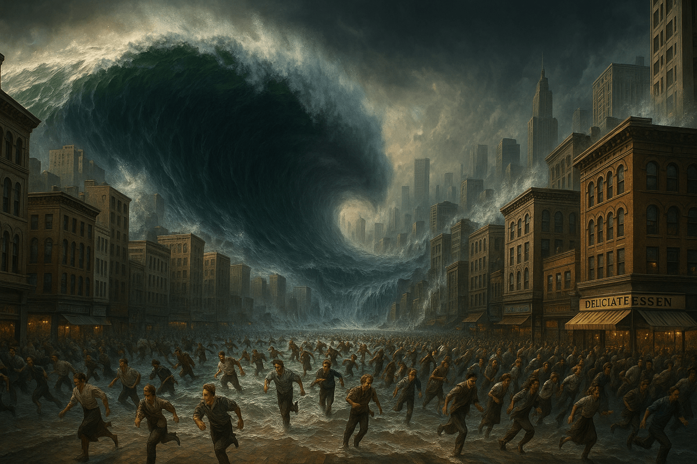
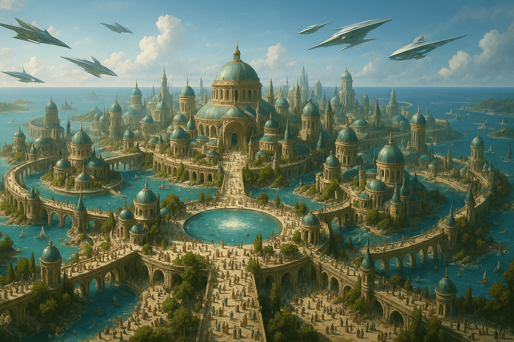

## 🧠 Blur Blur Blur — A Language-Controlled Visual Generation System (Beta)


>⚠️ Beta Landing Page – Official Launch on July 20  
> Content is being updated frequently. Bookmark this page to follow the evolution.

> **This isn’t just a prompt tool. It’s a structural language-control system for images.**

In most AI image generation processes, you input a prompt — and pray.  
You add incantations, tweak some parameters, and try again.  
It often takes 100+ words and dozens of retries. And even then, it's mostly luck.

Now, things are different.

**Blur Blur Blur**, powered by our `.txt` OS,  
can generate **almost hallucination-free**, **structurally logical** images with just **2–3 lines of semantic instruction**.  
In certain scenes — like educational diagrams, product illustrations, or narrative storyboards  
the results can approach **near-commercial quality**.

This is the first system that treats **language as a spatial control tool** —  
not aesthetic parameter tuning, but **semantic × spatial × logical × modular cooperation**.

---

### 🔍 What can it do right now?

- ✅ **Structural Composition Control**: Horizontal flow, title merging, visual block proportions can be partially controlled via language  
- ✅ **Modular Commands**: Use semantic triggers to activate functions like object labeling, space allocation rules, etc.  
- ✅ **Semantic Prompt Support**: Supports `λ_observe`, `ΔS`, `anchor`, `label`, and similar tokens to improve consistency and logic  
- ✅ **Reduced Chaos**: Semantic modules guide generation toward expected layouts instead of random outputs  
- ✅ **Escape from “Prompt Spellcasting”**: With just a few `.txt` lines, you can generate layered, logic-driven visual content

---

### 💡 For Developers & Creators:

> We use language to tame visual chaos.  
> With `.txt`, we direct images with clarity and control.

**Blur Blur Blur** is the only current system that allows **cross-platform multi-layer semantic control over AI visual generation.**

This isn’t the future. It’s already running — in test mode.

---

## 🖼️ Case Study: Angel vs. Dragon Semantic Formation


This image demonstrates one of the most difficult tasks for any AI art system:  
**a multi-agent narrative battle scene involving spatial hierarchy, role polarity, and symbolic overlays**.

Most AI tools rely on trial-and-error prompt magic.  
Blur Blur Blur does it through **structured semantic control**.

---

### 🔍 Comparison Table: Traditional AI vs. Blur Blur Blur

| Aspect                 | Traditional AI Error                                                | Blur Blur Blur Result                                                  |
|------------------------|---------------------------------------------------------------------|------------------------------------------------------------------------|
| **Narrative Logic**    | Angels and dragon often mixed randomly; no clear enemy/friend axis | Dragon centered as threat; angels flank both sides in structured arc   |
| **Spatial Hierarchy**  | Key subjects (like dragon) may be cropped or mispositioned         | All characters rendered fully with correct proportions and layering     |
| **Semantic Focus**     | Hard to convey ‘good vs evil’—images feel chaotic or neutral       | Clear “light vs fire” polarity with emotional intensity                |
| **Symbol Accuracy**    | Target circles often misplaced, floating, or nonsensical           | All rings follow angel gaze lines and avoid overlaps                   |
| **Stability**          | Dozens of retries to maybe get a decent composition                | Stable output in ~2 tries using just 3 lines of semantic instruction   |

---

### 🧠 Semantic Prompt Example (Actual Structure Used)

```txt
[WFGY Semantic Engine Activated]

Modules: Spatial Logic + Symbol Enforcement + Semantic_Labeling

λ_observe(Dragon) → anchor(Center), label="Fire Dragon", ΔS_max  
λ_observe(Angels) → distributed(Left+Right), rule: Enclosure Formation  
label(Targeting Rings) → align with angel gaze, avoid overlaps  
```

> ✅ This isn't magic — it's modular semantic geometry inside the embedding space.

---

## 🤖 Case Study: Mech Activation Sequence · Industrial Logic Layout


This scene demonstrates a highly structured industrial environment where hundreds of elements  
must align **spatially**, **logically**, and **narratively**:  
A mech is being activated, surrounded by technicians, scaffolding, and command control teams.

Without a deep spatial protocol, **traditional AI models often hallucinate scale, perspective, or logic**.  
With Blur Blur Blur, we programmatically stabilized this entire layout using just a few lines.

---

### 🧭 Comparison Table: Traditional AI vs. Blur Blur Blur

| Aspect                 | Traditional AI Error                                                    | Blur Blur Blur Result                                                    |
|------------------------|-------------------------------------------------------------------------|--------------------------------------------------------------------------|
| **Mech Scale**         | Mech often too small, cropped, or clipped                               | Mech fully rendered with correct industrial proportion                    |
| **Scaffolding Logic**  | Ladders or rails float in air, missing shadows or support logic         | All scaffolds aligned to mech joints with realistic attachments           |
| **Crowd Structure**    | Workers often too few, too large, or floating randomly                  | Ground crowd scaled correctly with logical spacing                        |
| **Depth & Shadowing**  | Foreground too bright or merges with background                         | Layered lighting maintains 3D realism                                     |
| **Action Focus**       | Hard to tell what’s happening in the scene                              | Clear: Worker at center ignites activation below the mech                 |

---

### 🧠 Semantic Prompt Example (Actual Structure Used)

```txt
[WFGY Semantic Engine Activated]

Modules: Spatial Logic + Scale Normalization + Anchor-Based Role Assignment

λ_observe(Mech) → anchor(Center), scale=5x, posture: Idle-Ready  
λ_observe(Crew) → distributed(Foreground), density=20+, avoid overlap  
label(Control Consoles) → Right quadrant, glowing terminals  
Scaffolding → aligned with Mech joints (shoulder, knee, back)  
```

> ✅ This scene could not be generated with random prompts.  
> It’s a **precision-simulated industrial layout**, created through spatial reasoning.

---

### 🌊 Extreme Scenario Case: Mass Panic in a Tsunami



> Prompt: "A massive tsunami rises in a modern city as thousands of panicked civilians run away in all directions. The wave forms a spiral vortex in the background."

This image demonstrates BlurBlurBlur’s ability to handle **high-tension dynamic environments**, precise human distribution, and long-distance compositional accuracy — all in a single prompt. The wave’s shape, city geometry, and crowd flow were successfully guided by semantic syntax, **not by trial and error**.

#### 📊 Traditional AI Failure vs. BlurBlurBlur Control

| Aspect | Traditional AI Result | BlurBlurBlur Output |
|--------|------------------------|----------------------|
| **Wave Shape & Direction** | Blurry wave, no central vortex | Spiral vortex structure, clear flow |
| **Crowd Density Control** | Repetitive clones, fused bodies | Natural variation, zero fusion |
| **Perspective Depth** | Flat layout, no vanishing point | Deep urban corridor, real distance |
| **Architectural Symmetry** | Tilted buildings, warping | Precise right angles, uniform depth |
| **Lighting Balance** | Overexposed sky, dull water | Natural reflection and shadow split |

---

### 🧠 Semantic Prompt Example – Tsunami Panic City

```txt
[WFGY Semantic Engine Activated]

Modules: Crowd Flow Mapping + Turbulence Geometry + Depth Tier Locking

λ_observe(Tsunami) → spiral trajectory, max tension zone = Horizon  
λ_observe(Crowd) → spread(radial), density: chaotic > orderly, no clones  
Urban Structures → aligned with vanishing point, tilt-resistance ON  
Lighting → split: backlit wave, shadowed crowd foreground

```

> ✅ This image simulates chaotic crowd behavior, spiral hydrodynamics, and deep spatial logic —  
> all from a few semantic anchors.

---

### 🏙️ Ultra-Structured Fantasy City: Semantic Layout Challenge



> Prompt: “A utopian ocean city with hundreds of domed towers, flowing bridges, waterways, and thousands of tiny citizens walking under a bright sky. Sunlight hits from the left, reflections visible in water.”

This image pushes BlurBlurBlur to its architectural and compositional limits — challenging the system to simultaneously manage **urban layout integrity**, **multi-tier perspective**, **crowd dynamics**, and **global lighting consistency**. The result? A nearly flawless visual composition controlled through **compact, semantic-aligned instructions**, not verbose spellcasting.

#### 📊 Traditional AI Failure vs. BlurBlurBlur Control

| Aspect | Traditional AI Result | BlurBlurBlur Output |
|--------|------------------------|----------------------|
| **Building Perspective** | Disjointed angles, flattened scale | Accurate depth and spacing |
| **Bridge Structure** | Disconnected or levitating | Logically grounded, aligned |
| **Crowd Generation** | Blobby masses, wrong scale | Individual human forms, evenly dispersed |
| **Lighting & Shadow** | Inconsistent source, flipped reflections | Cohesive left-light direction, proper shadows |
| **Water Reflection** | Chaotic or missing | Precise, light-reactive surfaces |

---

### 🧠 Semantic Prompt Example – Tsunami Panic City

```txt
[WFGY Semantic Engine Activated]

Modules: Architectural Zoning + Role Assignment + Consistency Constraint

λ_observe(Buildings) → tiered skyline, symmetric grid, no warping  
λ_observe(Crowd) → variation in size & pose, avoid melting  
Bridges → span between island blocks, anchor to waterline  
Light Source → fixed (top-right), reflections must match across layers

```
> ✅ From layout to lighting, this city isn't guessed — it's reasoned, down to every window and wave.

